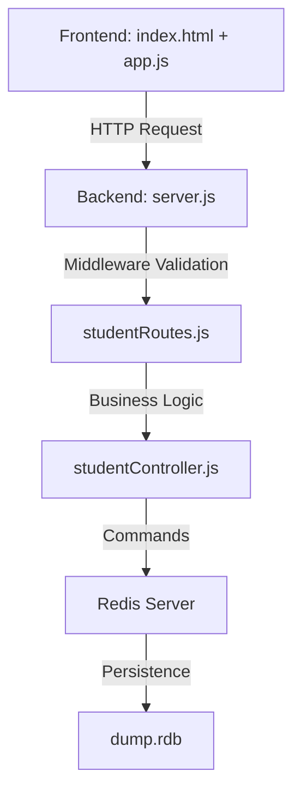

# Project Overview

## **Architecture**

## **Data Flow (Create Student)**

1.  **User Input:** The user fills in Name, Email, Course, Age, and Networth in the form.
2.  **Frontend (app.js):** Data is collected into a JSON object and sent via `fetch` (POST) to `/api/students`.
3.  **Backend (studentRoutes.js):** The `validateStudent` middleware checks if all fields are present and sanitizes them (e.g., lowercase email).
4.  **Backend (studentController.js):**
    - Generates a `uuidv4()` for the student ID.
    - Saves the data into a **Redis Hash** using `HSET` (key: `student:<id>`).
    - Adds the ID to a **Redis Set** using `SADD` (key: `students`) to track all student IDs.
5.  **Frontend (app.js):** After a successful response, the table is re-rendered by fetching all students from the backend.

## **Redis Key Structure**

- **Set: `students`**
  - Contains a list of all active student IDs.
- **Hash: `student:<id>`**
  - `id`: Unique UUID
  - `name`: Student name
  - `email`: Student email
  - `course`: Student course
  - `age`: Student age (string/number)
  - `networth`: Student networth (string/number)
  - `createdAt`: ISO timestamp
  - `updatedAt`: ISO timestamp
